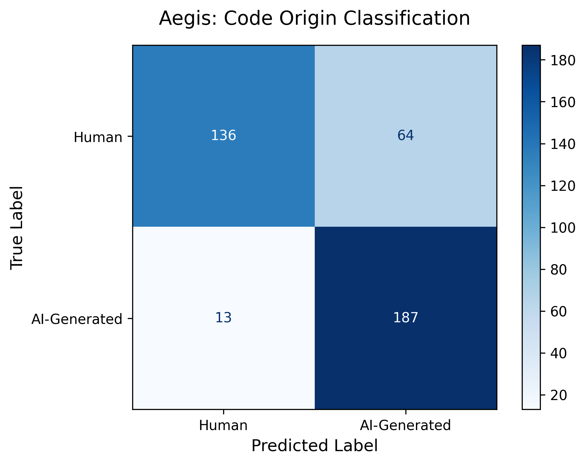
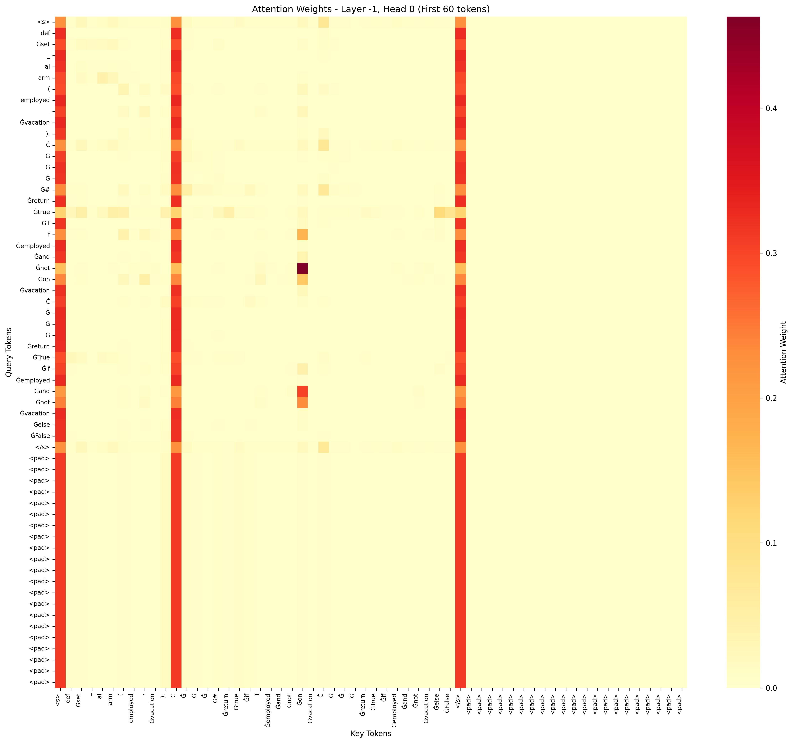

# Aegis: AI Python Code Detection Model

## Overview
Aegis is a fine-tuned CodeBERT model that classifies AI-generated and human code. CodeBERT has 125 million parameters, but using LoRA (Low-Rank Adaptation), Aegis was efficiently trained locally with only a subset of the original parameters being updated. The dataset used to train and evaluate Aegis was APPS, a Python benchmark for code generation. Model weights/adapters are hosted on Hugging Face at [anthonyq7/aegis](https://huggingface.co/anthonyq7/aegis).

## Problem Statement
**Can we detect AI-generated code in academic and professional settings?**

Generative AI has been integrated across various workflows, notably for coding tasks. The actual source of code, especially for academic integrity purposes, has come into question. This projects fine-tunes CodeBERT to explore:

1. **Classifying code origin**: Is it human or AI?
2. **Exploring detection limits**: Where does the model fail?
3. **Inform policy**: To what extent are its applications?

The model is evaluated on datasets of human and AI-generated solutions to similar competitive programming problems written in Python.  

## Features
Aegis's key features reside in binary classification of Python code snippets. As an encoder, the model aggregates the features of the sample to create an understanding of the input through 12 transformer layers after tokenization. Then, the [CLS] token is run through a linear classifier and used to determine whether the code is AI-generated or human. Aegis was efficiently fine-tuned using LoRA (Low-Rank Adaptation) to both reduce the trainable parameters and save computational resources and time. 

**Key capabilities summary:**
- Binary classification of Python code snippets
- Efficient fine-tuning using LoRA (Low-Rank Adaptation)

## Installation

### Requirements
- **Python**: 3.13+
- **ML/AI**: PyTorch, Transformers, PEFT, Accelerate
- **Data**: pandas, NumPy, Datasets
- **Visualization**: matplotlib, seaborn
- **ML Utils**: scikit-learn, safetensors, Hugging Face Hub, tqdm
- **Tools**: OpenAI, python-dotenv, pytest, Ruff

Aegis is written in [Python](https://www.python.org/downloads/). Installation is required for development and CLI use. 

### Installing uv

Before setting up the project, install uv (if not already installed). See the [uv docs](https://docs.astral.sh/uv/getting-started/installation/) for more details.

**Option 1: Using cURL**
```bash
curl -LsSf https://astral.sh/uv/install.sh | sh
```

**Option 2: Using pip**
```bash
pip install uv
```

### Setup
```bash
# Clone the repository
git clone https://github.com/anthonyq7/aegis.git
cd aegis
```

### Install dependencies

**Option 1: Using requirements.txt**
```bash
uv pip install -r requirements.txt
```

**Option 2: Using uv sync (recommended, uses uv.lock for reproducible installs)**
```bash
uv sync
```

### CLI Usage

The project includes a CLI for convenience.

DISCLAIMER: The training dataset consists of competitive Python coding questions from [APPS](https://huggingface.co/datasets/codeparrot/apps)

**Install the package in editable mode (from the project root)**:
```bash
pip install -e .
```

**Supported commands**:
```bash
# Predicting using a file
aegis --file path/to/code.py

# Predicting using text
aegis --text "def add(a, b):\n    return a + b"

# JSON output
aegis --file path/to/code.py --json > result.json

# Setting a threshold for AI classification 
aegis --file path/to/code.py --threshold 0.7

# Help
aegis --help
```

**Notes**:
- On first run, the model adapter is downloaded from the Hugging Face repo [anthonyq7/aegis](https://huggingface.co/anthonyq7/aegis) and cached under `~/.aegis/models`.
- Internet access is required on the first run; subsequent runs use local cache. 
- The CLI prints the predicted label and probabilities for human and AI.

## Key Results

### Model Performance
- **Accuracy**: 80.75%
- **Precision**: 74.50%
- **Recall**: 93.50%
- **F1-Score**: 82.93%

### Confusion Matrix


## Training Details

### Dataset
The model was trained on the APPS (Automated Programming Problem Solving) dataset, which contains:
- 2,000 human-written Python code samples
- 2,000 LLM-generated Python code samples  
- Balanced train/validation/test splits (80%/10%/10%)
- Duplicate removal and stratified sampling for balanced classes

Although the dataset for the training data is relatively small, it provided a consistent and predictable format for LLM-generated Python code samples. Additionally, a separate subset of questions were formed into prompts for the LLM-generated Python code samples to reduce leakage. 

APPS was chosen after multiple rounds of synthesizing AI-generated code via OpenAI calls attempting to match the code found in [The Stack](https://huggingface.co/datasets/bigcode/the-stack-v2-dedup). The inconsistencies in The Stack dataset made synthetic code too easy to detect, resulting in unrealistically high metrics (99.4% across all measures). To balance cost and effectiveness, Aegis was trained and evaluated on a smaller dataset.

[CodeParrot APPS Hugging Face Link](https://huggingface.co/datasets/codeparrot/apps)

## Methods
Simply writing scripts to collect the sample data wasn't sufficient. There were many unpredictable markers in the human code: excerpts of the question, comments to mark the author, and watermarks. Given the small size of the dataset, such watermarks were manually removed to make the human code more homogenous. While writing scripts to perform cleaning is more effective, especially when working with larger datasets, manual cleanup in this case saved roughly 90 to 120 minutes. 

After the AI-generated data was collected it was processed alongside the human code dataset. Duplicates were dropped before the datasets were combined and shuffled. The train, validation, and test splits were chosen to be 80%, 10%, 10% respectively: a standard split. 

The model training was conducted using LoRA (Low-Rank Adaptation). This allowed for more efficient training in terms of computation and speed. The pretrained CodeBERT base weights were kept frozen and learned a low-rank update. This created an new, effective weight:

$$
W_{\text{eff}} = W + \Delta W = W + \frac{\alpha}{r} B A
$$

$$
W = \text{frozen pretrained weight matrix}
$$

$$
A \in \mathbb{R}^{r \times d}, \quad B \in \mathbb{R}^{d \times r}
$$

$$
r = \text{low-rank dimension}
$$

$$
\alpha = \text{LoRA scaling factor}
$$

The LoRA adapter parameters, the B and A matrices, are the only components that are changing. 

### Training Configuration
- **Epochs**: 3
- **Batch Size**: 4 (effective batch size: 32 with gradient accumulation)
- **Learning Rate**: 1e-4
- **Weight Decay**: 0.01
- **Warmup Ratio**: 0.1

Training ran for 3 epochs, sufficient as most gains occur within the first 2 to 3 epochs with CodeBERT. Each batch processed 4 samples with 8 gradient accumulation steps, creating an effective batch size of 32. Since batch size is the number of examples the model sees before updating weights, 4 samples fits within memory limits. Combined with gradients across 8 small batches, this creates a stable batch size of 32 and yields more consistent weight updates. The learning rate was set to 1e-4 (0.0001) as a conservative measure to preserve CodeBERT's pretrained weights while still adapting to the task. Learning rate controls the step size for weight updates, which when too high can damage pretrained features while when too low can prevent learning. 1e-4 is a common starting point, hence why it was chosen. A weight decay of 0.01 adds L2 regularization to reduce overfitting, preventing memorization. A warmup ratio of 0.1 linearly increases the learning rate over the first 10% of training, which lowers the risk of divergence during training from large jumps (learning rate being too high at initialization). 

## Architecture
- **Base Model**: Microsoft CodeBERT (125M parameters)
- **Fine-tuning Method**: LoRA (Low-Rank Adaptation)
- **LoRA Configuration**:
  - Rank (r): 4
  - Alpha: 16
  - Dropout: 0.1
  - Target modules: query, value, key

## Analysis

Positive = AI-generated (target class)

Negative = Human (baseline)

### Results Analysis
Aegis had an accuracy of 80.75%, a precision of 74.50%, and a recall of 93.50%. The results indicate that of the predictions flagged as AI-generated, 74.50% were correct. Additionally, the recall of 93.50% suggests that the vast majority of AI code was flagged. The confusion matrix tells a similar story, with 187/200 AI samples correctly identified, leaving only 13 false negatives. The high recall and lower precision demonstrates that the model skews towards flagging AI code. However, Aegis struggles with false positives: of the 200 human code samples, 64 were misclassified as AI, a rate of 32%. 

### Attention Weights Analysis


The figure above displays the attention weights for the first tokens of an input in Head 0 of the last encoding layer (Layer -1). The vertical orange columns suggest a strong relationship between the query tokens and the `<s>`, `Ċ`, and `</s>` key tokens. `<s>` and `</s>` often represent BOS (Begin-Of-Sequence) and EOS (End-Of-Sequence), attracting strong attention as they act like anchors for the sequence. However, Ċ is a stand-in for a newline character (think \n), implying Aegis attends to line breaks. Newlines, indentations, and definition blocks comprise common structural cues for Python code, and the model being aware of newlines to orient itself in a function block is reasonable. Additionally, the faint diagonal from the top-left to bottom-right in the figure indicates that tokens often look at nearby neighbors, which makes sense given Python's reliance on local context.

### Error Analysis
The false positive rate of 32% can be attributed to two sources of error: manual data cleaning and the small sample size. The removal of author comments, watermarks, and other artifacts in human code reduced authentic human variation in the training data, increasing the homogeneity of the human and AI-generated code. The 64 false positives were likely a result of human code looking clean and structured, resembling AI output. Additionally, the small sample size resulted in less coverage of code style and less variation, potentially allowing for the learning of false patterns. 

### Implications
A high recall of 93.50% suggests a reasonable accuracy for use in academic integrity settings. However, the 32% rate of false positives for human code can lead to unfair suspicion. Regardless, Aegis's strength lies in its ability to reliably flag AI code. Further investigation can be conducted in the future to limit false positives by expanding the training data and adding additional classes, such as a "Likely AI" class. 

## Scripts

### Training
```bash
python model/train.py
```

### Evaluation
```bash
python model/eval.py
```

### Data Preprocessing
```bash
python data/preprocess.py
```

### Testing
```bash
# Run all tests
pytest tests/

# Run with verbose output
pytest tests/ -v

# Run a specific test file
pytest tests/test_basic.py

# Or run tests directly
python tests/test_basic.py
```

The test suite includes:
- **Basic sanity tests**: Validates core module imports, Python version, and return types
- **Data processing**: Checks message structure and JSONL parsing

## CI/CD

Lint and unit tests automatically run on push and pull requests via GitHub Actions. Some tests may be skipped if dependencies are not installed (see `.github/workflows/test.yml`).

### Ruff Commands for CI

Ruff is used for linting. See the [Ruff docs](https://docs.astral.sh/ruff/linter/) for more details. 

- **Check code style:**
  ```bash
  ruff check .
  ```
- **Auto-fix issues (where possible):**
  ```bash
  ruff check --fix .
  ```
  
## Contributing

Contributions are welcome and appreciated.
If you'd like to help, please follow these steps:

1. **Fork** the repository  
2. **Create** a new branch
3. **Commit** your changes 
4. **Push** to your branch 
5. **Open a Pull Request**

Ensure your code follows the existing style and passes any tests before submitting. 
Open an issue or submit a suggestion if you're unsure where to start. 

## Contact
**Email**: a.j.qin@wustl.edu

## License
This project is licensed under the [MIT License](LICENSE).
